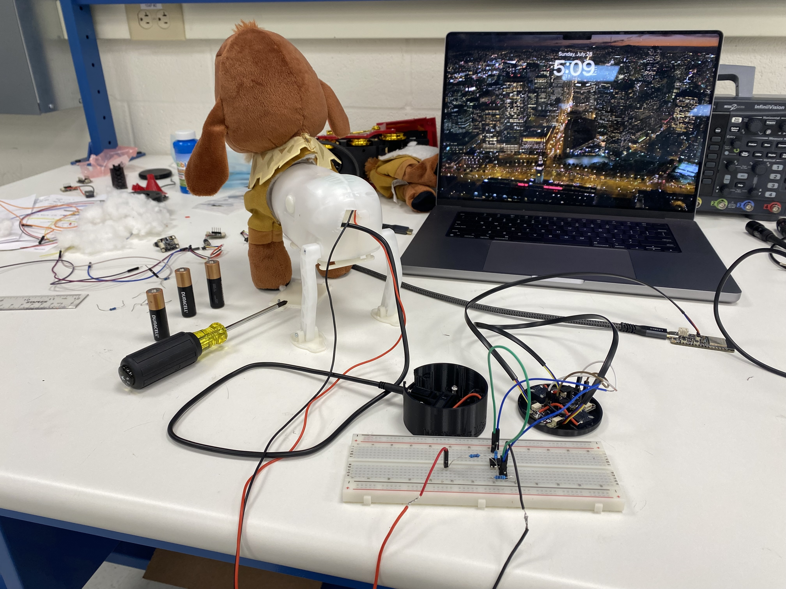
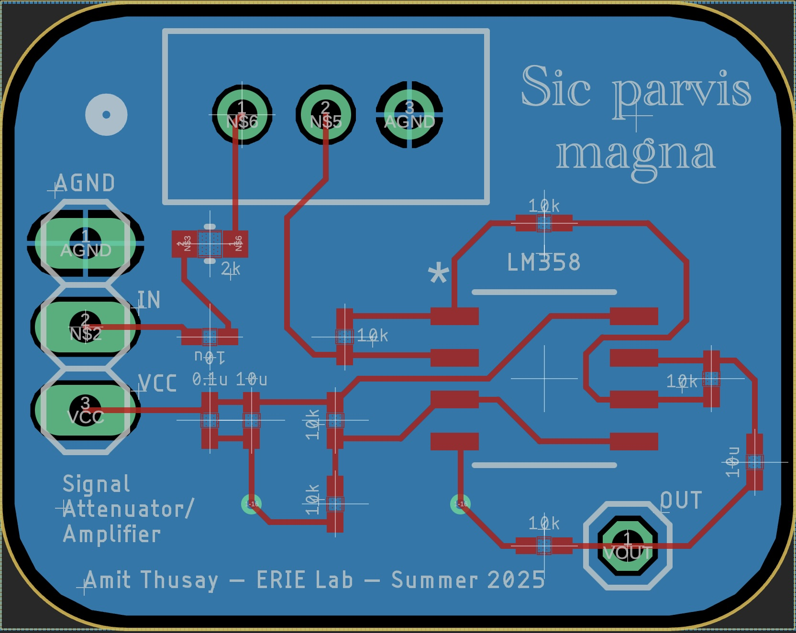
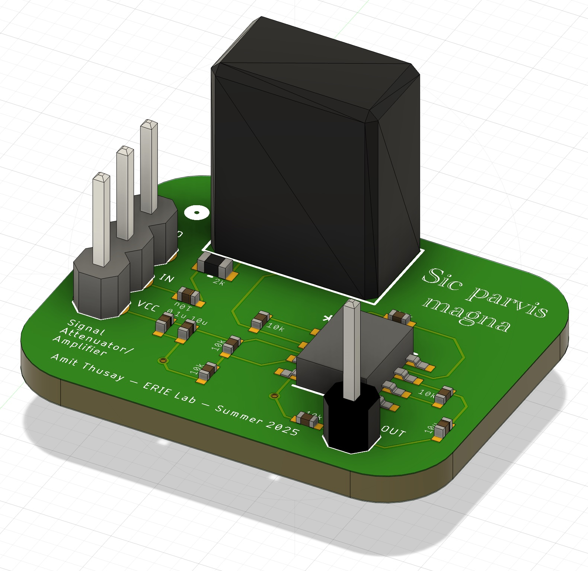

[← Back to Projects](../README.md)

# Haptic-Enabled Switch Adapted Toys (HESAT)

---

## Overview

This project explores integrating **haptic feedback** into **switch-adapted toys (SATs)** to provide new sensory pathways for children with cerebral palsy, motor impairments, or hearing loss.  

- **Switch-adapted toys (SATs):** Commercial toys modified with accessible input mechanisms, enabling children to interact using movements or muscles they can precisely control.  
- **Haptic feedback:** Vibrotactile signals (similar to a phone vibration) that provide an additional layer of sensory input, especially beneficial for children who are deaf or hard of hearing.  

The ultimate goal is to create **affordable, educational, and therapeutic devices** that can be used by teachers, therapists, and caregivers to enrich play and therapy experiences.

---

## Project Timeline

### Summer 2024
- Developed the first prototype using an **ESP32** microcontroller.  
- Integrated vibrotactile motors into toy input mechanisms.  
- Presented the prototype to **ReplayForKids**, a nonprofit that adapts toys for children with disabilities.  
- Gained hands-on skills with oscilloscopes, soldering, and circuit debugging.

### Fall 2024
- Explored **therapeutic applications** of haptic devices, building from a master’s thesis that inspired HESAT.  
- Wrote **MATLAB scripts** to emulate haptic waveforms described in the thesis.  
- Experimented with **non-traditional haptic actuators** for more expressive feedback.

### Spring 2025
- Designed and built a **Haptic Driver + Signal Attenuator/Amplifier PCB**.  
- Prototyped a **button enclosure** that integrates the PCB and haptic module into a more user-friendly package.  
- Began preparing kits for upcoming workshops with ReplayForKids.  

### Summer–Fall 2025 (Planned)
- Continue evaluating prototypes with educators and therapists.  
- Run pilot studies with ReplayForKids to refine usability and therapeutic impact.  

---

## Prototype Gallery

### First Button Enclosure Prototype
  
*Early prototype of button enclosure with integrated haptic driver.*

### PCB Development
  
*Custom PCB integrating driver and amplifier for vibrotactile feedback.*  

  
*PCB populated and tested with enclosure.*

### Workshop Kits (in progress)
  
*Kit concept prepared for ReplayForKids workshops.*

---

## Impact

By combining **accessible input methods** with **haptic feedback**, HESAT aims to:  
- Increase engagement for children with multiple sensory impairments.  
- Provide therapists and educators with more versatile tools.  
- Extend the ReplayForKids mission into new therapeutic applications.  

---

*This repository documents the public-facing aspects of HESAT. Source code, detailed schematics, and unpublished test results remain private.*

[← Back to Projects](../README.md)