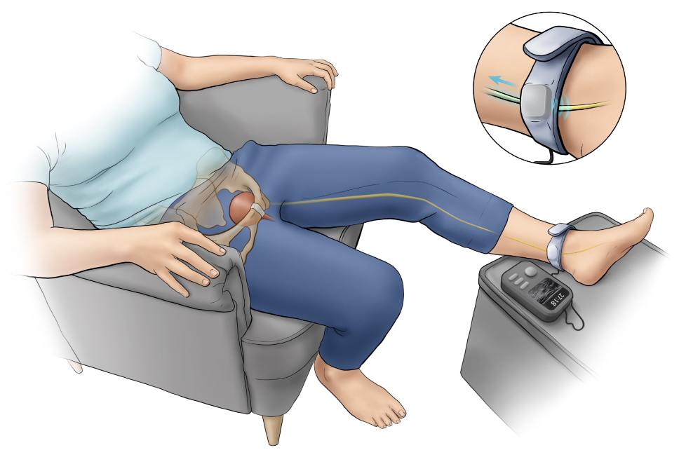

# Projects

Welcome! This repo contains some information on the projects I've worked on so far. If you have any questions about these projects or would like to reach out, please email me at amt272@case.edu.

---

## Featured

> ### [HESATs](HESAT/README.md)  
> 

>   <a href="HESAT/README.md">
>     
>   </a>
> 

> Haptic-Enabled Switch Adapted Toys  
> Prototyping PCB and Switch Enclosure for ReplayForKids workshop kits.

---

> ### [SUNS](SUNS/README.md)  
> 

>   <a href="SUNS/README.md">
>     
>   </a>
> 

> Steerable Ultrasonic Tibial Nerve Stimulator  
> SOURCE STEM Research funded (Summer 2025).

---

> ### SDR + FPGA Concept  
> 

>   <a href="SDR/README.md">
>     
>   </a>
> 

> Multi-channel SDR transceiver concept — *coming soon*.