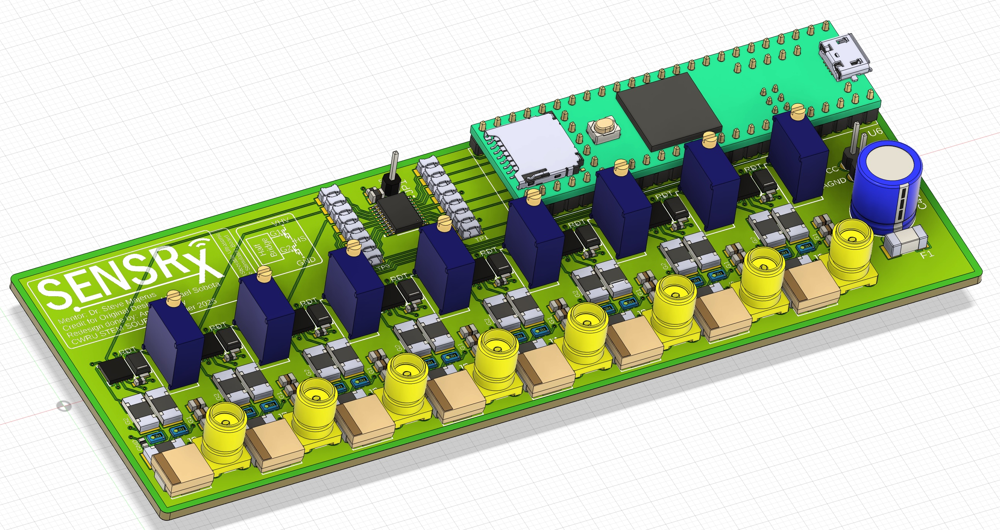
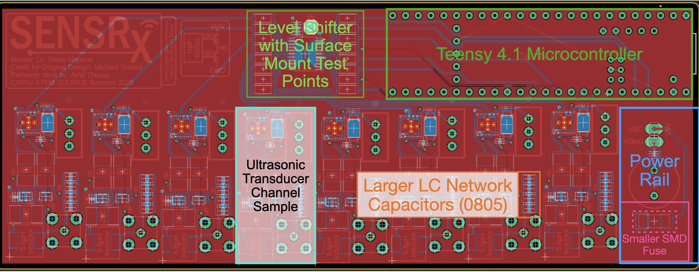
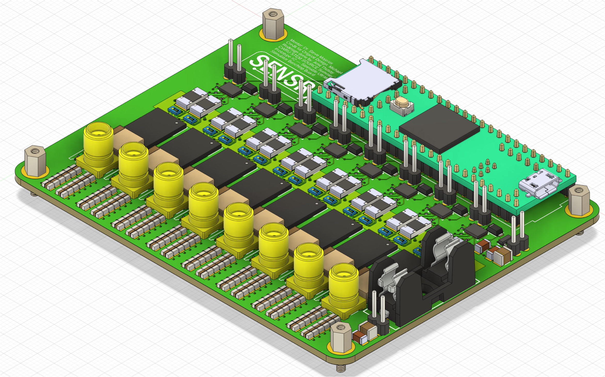
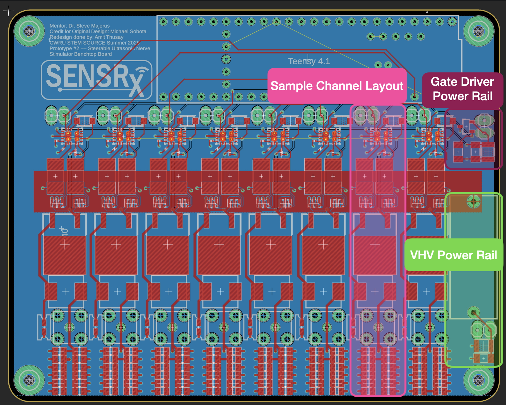
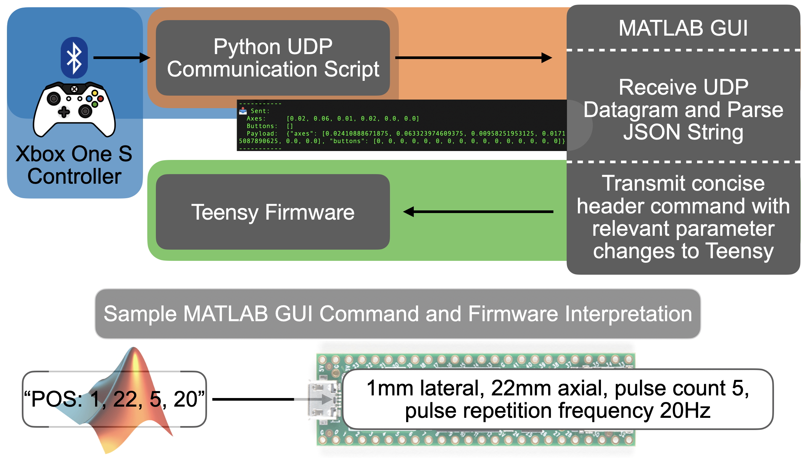
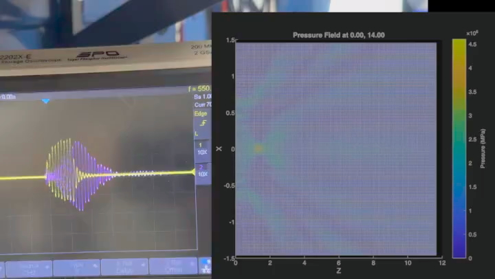

[← Back to Projects](../README.md)

# Steerable Ultrasonic Nerve Stimulator (SUNS)

---

## Overview

The goal of this project is work towards developing a cost-effective, non-invasive and easy to use clinical grade nerve stimulator that stimulates superficial peripheral nerves using focused ultrasound and traditional electrical stimulation techniques. Some symptoms that this device may be used to alleviate include peripheral and diabetic neuropathy, migraines, overactive bladder syndrome, and chronic pain. I received SOURCE STEM Funding in Summer 2025 to continue this project; I also presented my project at INTERSECTIONS Summer 2025. That summer, I developed a system that allows any game controller (an Xbox One controller was used in this case) to adjust array properties of the ultrasonic transducers in real-time. I also prototyped 2 benchtop PCBs to improve signal integrity and form-factor on the board. Below are some visualizations of the changes I implemented. I'm anticipating on purchasing the supplies for the second-prototype soon. Future goals include:
- interfacing the device with a benchtop clinical-grade electrical stimulator (Digitimer DS5) to synchronize ultrasonic and e-stim pulses, and testing this setup in an agarose-gel phantom media with embedded sensors.
- developing an imaging array for a closed-loop system
- continuing to reduce board form factor

---

## Prototype Progress

### First Prototype
- Initial PCB for improving form-factor and signal integrity

  
*Prototype 1 – Render*

  
*Prototype 1 – Layout*

---

### Second Prototype
- Updated board to include half-bridge gate drivers capable of driving GaN FETs
- Included fuse and convenient capacitor bed for tuning impedance network

  
*Prototype 2 – Render*

  
*Prototype 2 – Layout*

---

## Testing Environment

  
*Water tank for testing transducer array with hydrophone*

---

## System Flow

  
*Flow Chart visualizing how real-time control for SUNS is accomplished*

---

## Demonstration
> Apparently GitHub struggles with embedding videos on to markdown files, if you click on the image, you should be able to download the video. Sorry about that

- Oscilloscope Waveform Legend
- 🟣 **Hydrophone Output**  
- 🟡 **LC Network Output**

---

*This repository documents public-facing details of SUNS development. Design files, source code, and proprietary schematics are kept private.*
